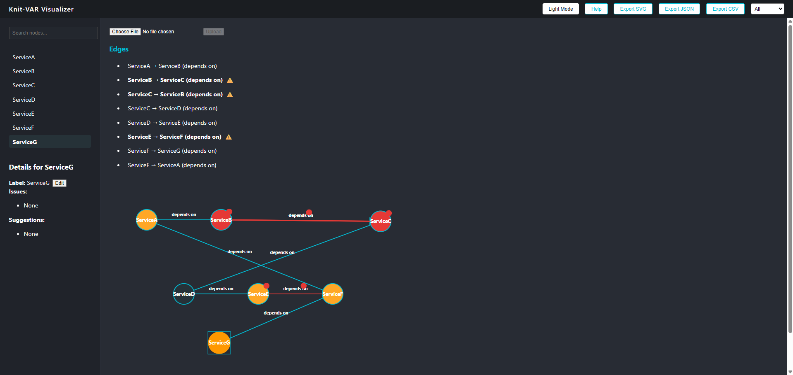
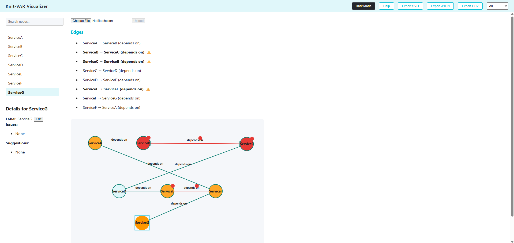
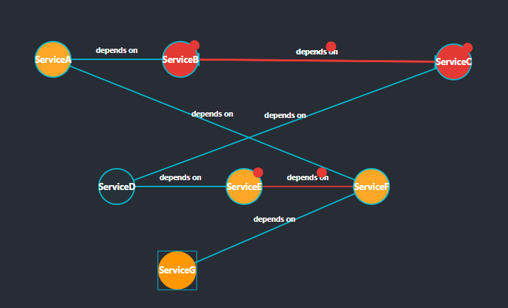
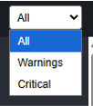
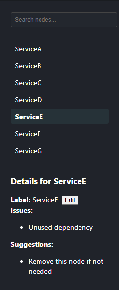
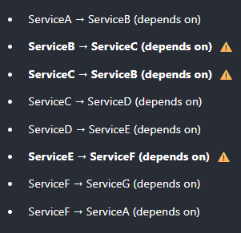
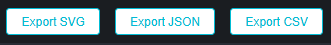
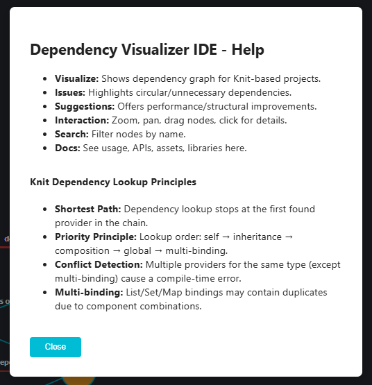

# Knit-VAR
### Tiktok TechJam 2025 Challenge - **5. Visualising Architecture with Knit**

A web-based tool to visualize and analyze dependencies in Kotlin Knit-based projects.  
The tool highlights potential issues, suggestions for improvement, and allows interactive exploration of project dependencies.

---

## Features

- **Interactive Dependency Graph**: Visualizes nodes (modules/services) and edges (dependencies) in an intuitive graph layout.
- **Issue Detection**:
  - Circular dependency detection
  - Unused dependency detection
- **Suggestions & Improvements**: Provides actionable recommendations for refactoring or performance enhancements.
- **Graph Enhancements**:
  - Node color coding based on severity (`default`, `warning`, `critical`)
  - Zoom and pan interactions
  - Node and edge filtering
- **Export Options**: Export graph data in JSON or CSV formats, and export the visual graph as SVG **_(incomplete)_**
- **Demo/Test Data**: Built-in sample data to showcase features without requiring a Knit project.

> **Screenshot:**  
> 
> 

---

## Development Tools

- **Frontend**: React, TypeScript
- **Backend**: Springboot (Java)
- **IDE**: IntelliJ IDEA 2025.2
- **Version Control**: GitHub & SourceTree

---

## Libraries & APIs Used

- **React** – Frontend UI framework
- **TypeScript** – Type safety for the frontend
- **D3.js / SVG** – Interactive graph visualization
- **Fetch API** – File upload and backend communication
- **Knit Dependency Analysis** – Custom JS/TS module (`analyzeDependencies.ts`) for detecting cycles, unnecessary dependencies, and generating suggestions

---

## Assets

- Demo/test dataset (`demoDependencyData.ts`) for showcasing graph features
- Icons for warnings/circular dependencies (inline SVG/emoji used)
- No third-party copyrighted material included

---

## Usage

1. **Setup**
    * Clone the repository and install dependencies using `npm install`.
    * Navigate to backend folder and start with `mvn-springboot:run`.
    * Navigate to front end and start with `npm start`.
    * Open the frontend local host URL in your browser.
   
2. **Upload a Kotlin `.kt` file** (optional)

    * The tool parses dependencies and displays them in the graph.

> **Visual Representation:**  
> 

3. **Interact with the Graph**

    * Click nodes to view details and suggestions in the sidebar.
    * Click edges to inspect dependencies and issues.
    * Use the search bar to filter nodes.
    * Click any node and use the mouse scroll to zoom and/or drag to pan for better visibility.

> **Filtering Options:**  
> 

> **Suggestions:**  
> 

> **Edges/Relations Analysis:**  
> 

4. **Export Options**

    * Export CSV/JSON of nodes and edges. **_(incomplete)_**
    * Export the graph visualization as SVG.
   
> **Export Options:**  
> 

5. **Demo Data**

    * If no file is uploaded, the tool loads `demoDependencyData` to demonstrate features when first accessing the web app / upon refresh.
> **Demo Data:**  
> 

6. **Basic Help Panel**

> **Help Panel:**  
> 

---

## Repository
[Link to Github Repository](https://github.com/HM33-Alt/knit-VAR/)

---

## Demonstration Video
[Knit Dependency Visualizer Demo](https://youtu.be/BEdtl-3Wsjk)
* **Duration:** < 3 minutes
* Showcases interactive graph, issue detection, and export features

---

## License
MIT License

---

## Acknowledgements
* Parts of the code in this project were assisted by GitHub Copilot. Provided suggestions were reviewed, modified, and integrated by myself (solo developer/entrant).
